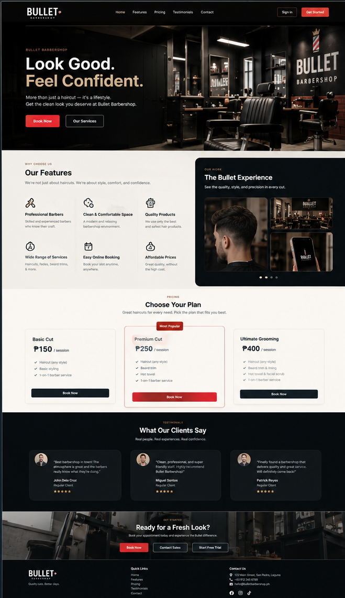
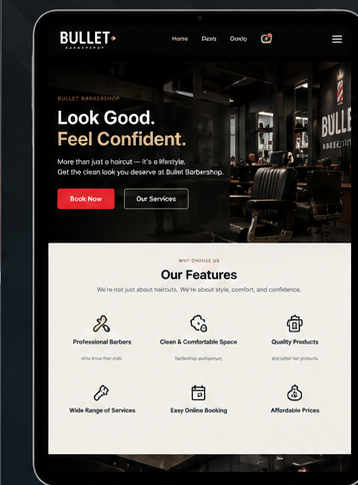
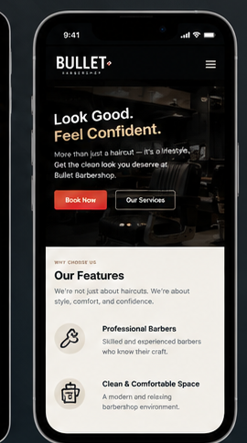
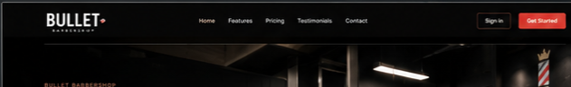
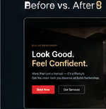
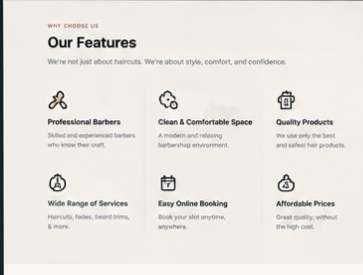

# week05-product-landing-page

# Bullet Barbershop — Product Landing Page

## 1. Project Title

**Bullet Barbershop — Responsive Product Landing Page**

---

## 2. Introduction

### What is a Product Landing Page?

A Product Landing Page is a webpage designed to introduce and promote a product or service. It usually contains important information such as the services offered, features, prices, customer reviews, and contact information.

### Why Landing Pages are Important for Businesses

Landing pages are important because they help businesses show their services in a simple and organized way. They can also attract new customers, provide important information, and encourage visitors to book a service or contact the business.

### Purpose of the Project

The purpose of this project is to create a responsive landing page for **Bullet Barbershop**. The project demonstrates the use of responsive web design, Tailwind CSS, and reusable Blade Components to create a clean and user-friendly website.

---

## 3. Objectives

The objectives accomplished during this activity are:

* Create a responsive landing page for a business.
* Apply Mobile-First Web Design principles.
* Use responsive breakpoints for different screen sizes.
* Practice using Flexbox and CSS Grid.
* Use Tailwind CSS for styling.
* Create reusable Blade Components.
* Organize website files using a proper folder structure.
* Design a consistent and user-friendly interface.
* Make the website accessible on desktop, tablet, and mobile devices.
* Practice organizing screenshots and documentation for a web project.

---

# 4. Responsive Web Design

Responsive Web Design is a way of designing websites so that they can adjust to different screen sizes and devices. The Bullet Barbershop landing page was designed to work properly on desktop computers, tablets, and mobile phones.

### Mobile-First Design

Mobile-First Design means designing the website for smaller screens first before adjusting it for larger screens. This helps make sure that the most important content is easy to see and use on mobile devices.

For Bullet Barbershop, the navigation, services, pricing, and other sections are arranged to remain readable and easy to use on smaller screens.

### Responsive Breakpoints

Responsive breakpoints allow the website layout to change depending on the screen size. Tailwind CSS provides responsive classes that can be used to change the layout, spacing, text size, and other elements.

For example:

```html
<div class="grid grid-cols-1 md:grid-cols-2 lg:grid-cols-3">
```

This allows the content to use:

* 1 column on small screens
* 2 columns on medium screens
* 3 columns on large screens

### Flexbox

Flexbox is used to arrange elements in a row or column. It is useful for navigation bars, buttons, and other parts of the interface.

Example:

```html
<div class="flex items-center justify-between">
```

This helps position elements properly while keeping the layout flexible.

### CSS Grid

CSS Grid is useful for arranging content into rows and columns. It was useful for sections such as the services and pricing areas of the Bullet Barbershop website.

Example:

```html
<div class="grid grid-cols-1 md:grid-cols-2 lg:grid-cols-3">
```

### User Experience (UX)

User Experience refers to how easy and comfortable a website is to use. The Bullet Barbershop landing page uses clear sections, readable text, visible buttons, and consistent spacing to make it easier for visitors to find information.

### Importance of Responsive Design

Responsive design is important because people use different devices when browsing websites. A responsive website provides a better experience by making sure that the content remains readable and usable regardless of the screen size.

---

# 5. Tailwind CSS

Tailwind CSS is a CSS framework that provides utility classes for quickly styling HTML elements. Instead of creating many custom CSS rules, developers can use Tailwind classes directly in their HTML or Blade files.

## Utility-First CSS

Utility-First CSS means using small classes that perform specific styling functions.

For example:

```html
<button class="px-6 py-3 rounded-lg font-semibold">
    Book Now
</button>
```

Each class controls a specific part of the button's appearance.

## Advantages of Tailwind CSS

Tailwind CSS provides several advantages:

* Faster development
* Easy responsive styling
* Consistent design
* Less custom CSS
* Easy spacing and sizing
* Simple component styling

## Responsive Utility Classes

Tailwind provides responsive classes using breakpoints such as `sm`, `md`, `lg`, and `xl`.

Example:

```html
<h1 class="text-3xl md:text-5xl lg:text-6xl">
    Bullet Barbershop
</h1>
```

The heading becomes larger on medium and large screens.

## Component Styling

Tailwind CSS can be used to style reusable components such as buttons, cards, navigation bars, and sections.

Example:

```html
<a href="#" class="px-6 py-3 rounded-lg font-bold">
    Book an Appointment
</a>
```

This makes it easier to keep the design consistent throughout the website.

---

# 6. Blade Components

## What are Blade Components?

Blade Components are reusable parts of a Laravel website's user interface. They allow developers to create a component once and reuse it in different parts of the project.

Examples of components that can be used in Bullet Barbershop include:

* Navigation Bar
* Hero Section
* Service Cards
* Pricing Cards
* Testimonial Cards
* Footer
* Buttons

## Why Reusable Components Improve Maintainability

Reusable components make the project easier to maintain because the same code does not need to be written repeatedly. If a component needs to be changed, the developer can update the component instead of changing every page individually.

## Benefits of Modular UI Development

Modular UI development provides the following benefits:

* Reduces repeated code
* Makes the project more organized
* Makes updates easier
* Improves consistency
* Makes components easier to reuse
* Makes the project easier to understand

### Example Blade Component

A simple Blade component can look like this:

```blade
<div class="rounded-xl p-6 shadow-lg">
    <h3 class="text-xl font-bold">{{ $title }}</h3>
    <p>{{ $description }}</p>
</div>
```

The component can then be reused with different information.

Example:

```blade
<x-service-card
    title="Classic Haircut"
    description="A clean and professional haircut."
/>
```

This allows different service cards to use the same design while displaying different content.

### Blade Components Folder Screenshot

**Insert your Blade Components Folder screenshot here.**

> `screenshots/blade-components-folder.png`

---

# 7. User Interface Design

The Bullet Barbershop landing page was designed to have a clean, modern, and professional appearance suitable for a barbershop business.

## Color Palette

The color palette was selected to give the website a strong and professional barbershop feel. The colors are used consistently throughout the navigation bar, buttons, cards, sections, and other interface elements.

The main colors are used to:

* Create visual identity
* Highlight important buttons
* Separate different sections
* Make important information easier to notice

## Typography

Simple and readable typography was used throughout the website. Different font sizes and weights help create a clear hierarchy between headings, descriptions, prices, and other information.

For example:

* Large text is used for the main hero heading.
* Medium-sized headings are used for sections.
* Smaller text is used for descriptions and supporting information.

## Iconography

Icons are used to support information and make some parts of the website easier to understand. They help users quickly recognize services, features, or actions without depending only on text.

## Button Styles

Buttons are designed to be noticeable and easy to use. The buttons use consistent spacing, rounded corners, and clear text.

Examples include:

* **Book Now**
* **View Services**
* **Get Started**

## Card Design

Cards are used to organize information such as services, prices, and testimonials. Each card follows a similar design so users can easily compare the information.

## Layout Consistency

The same spacing, typography, colors, buttons, and card styles are used across the website. This creates a consistent interface and makes the website easier to navigate.

### How the Design Improves User Experience

The design choices help users quickly understand what Bullet Barbershop offers. A clear layout, readable text, visible buttons, and organized sections make it easier for customers to browse services and find information.

---

# 8. Folder Structure

The project uses an organized folder structure to keep the files easy to find and maintain.

```text
bullet-barbershop/
│
├── resources/
│   └── views/
│       ├── layouts/
│       ├── components/
│       └── pages/
│
├── public/
│
├── screenshots/
│
├── documentation/
│
└── README.md
```

### `resources/views/layouts`

This folder contains the main layouts used by the website. Layout files can contain shared elements such as the main HTML structure, navigation, and other common parts.

### `resources/views/components`

This folder contains reusable Blade Components. Examples include buttons, cards, navigation elements, and other UI components.

### `resources/views/pages`

This folder contains the main pages of the website. It can contain the landing page and other page-specific views.

### `public`

The `public` folder contains publicly accessible files such as images, CSS, JavaScript, and other assets used by the website.

### `screenshots`

This folder contains screenshots showing the different parts and views of the project. These screenshots are included as evidence of the completed activity.

### `documentation`

This folder contains project documentation and other files related to the project requirements.

---

# 9. Screenshots

The following screenshots show the different parts of the Bullet Barbershop landing page and project structure.

## Desktop View



---

## Tablet View



---

## Mobile View



---

## Navigation Bar


---

## Hero Section



---

## Features Section


---

## Pricing Section

**Insert Pricing Section screenshot here.**

``

---

## Testimonials

**Insert Testimonials screenshot here.**

``

---

## Footer

**Insert Footer screenshot here.**

``

---

## Blade Components Folder

**Insert Blade Components Folder screenshot here.**

``

---

# Conclusion

The Bullet Barbershop Product Landing Page demonstrates the use of responsive web design, Tailwind CSS, and Blade Components. The project focuses on creating a clean and responsive website that can provide customers with information about the barbershop's services, prices, and customer experiences.

Through this activity, the project also demonstrates how reusable components and an organized folder structure can make a web application easier to develop, maintain, and update.

